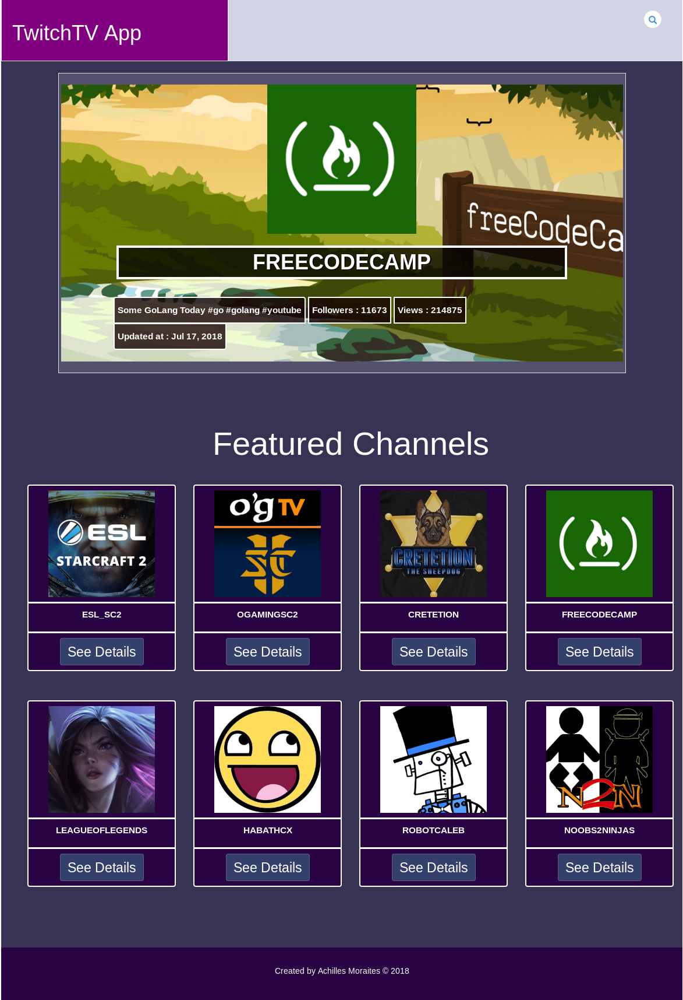

"# TwitchTV-Angular-App"

## Angular app using TwitchTV api
### Notes:
The app is using <a href='https://wind-bow.glitch.me/' target='blank_'>this api</a> to access the twitch tv as an api key is needed . You are free to change it if needed.

## Project Status screen shot

## Notes
<a href="https://support.google.com/chrome/answer/1342714" target="blank_">Fix the error "This page is trying to load scripts from unauthenticated sources" </a>
### See it live (And buggy..)
<a href="https://cyb3rn4u7.github.io/TwitchTV-Angular-App/app/" alt="Project Live Location" target="blank_"> Go to live version ! </a>
